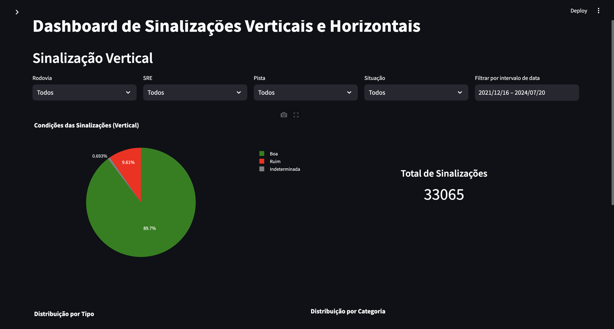
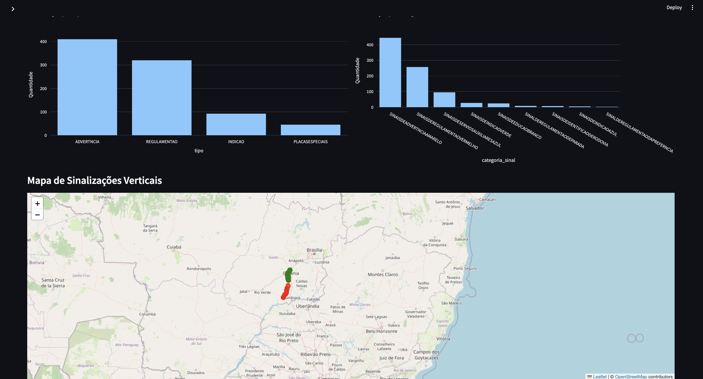
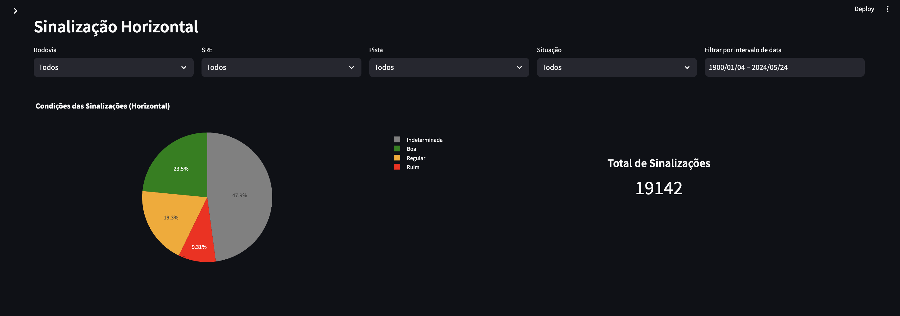
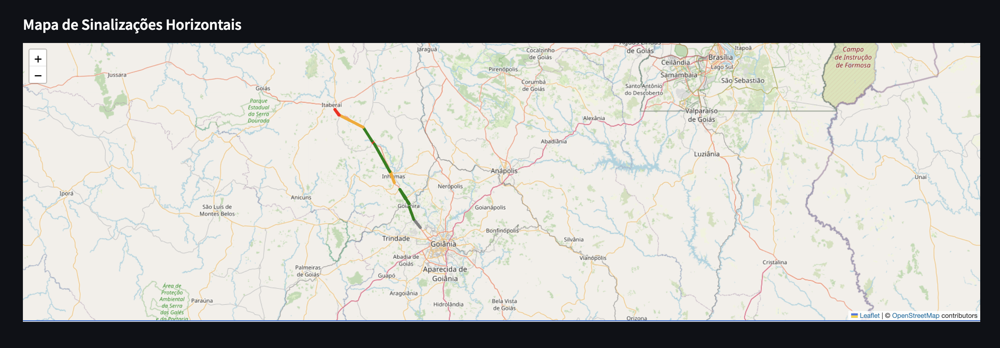

# Dashboard de Sinalizações Verticais e Horizontais

Este projeto é um dashboard interativo que exibe visualizações e mapas de sinalizações verticais e horizontais utilizando os dados fornecidos. O dashboard permite aos usuários explorar informações sobre as condições das sinalizações em diferentes rodovias, filtrando por tipo, rodovia, situação, e data. Além disso, o mapa mostra a localização das sinalizações com cores indicativas do estado de conservação (Boa, Ruim, Regular, Indeterminada).

## Tecnologias Utilizadas

- **Python**: Linguagem principal do projeto.
- **Streamlit**: Framework utilizado para criar a interface interativa do dashboard.
- **Pandas**: Biblioteca usada para manipulação e análise de dados.
- **Plotly Express**: Ferramenta utilizada para criar os gráficos interativos.
- **Folium**: Biblioteca para gerar mapas interativos.
- **Streamlit Folium**: Para integrar os mapas Folium com o Streamlit.
- **HTML/CSS**: Utilizado para personalizar a interface e os estilos dos cards e textos.

## Funcionalidades

1. **Gráficos de Pizza**: Mostra a distribuição das condições das sinalizações (Boa, Ruim, Regular, Indeterminada).
2. **Gráficos de Barras**: Exibe a quantidade de sinalizações por tipo e categoria.
3. **Mapa Interativo**:
    - Exibe as sinalizações verticais e horizontais em um mapa.
    - As cores indicam a condição da sinalização (Verde para Boa, Vermelho para Ruim, Amarelo Escuro para Regular, Cinza para Indeterminada).
    - Círculos preenchem os pontos das sinalizações verticais.
    - Linhas coloridas representam os trechos de sinalizações horizontais.
4. **Filtros**:
    - Filtro por rodovia, SRE, pista, situação e data.
5. **Card de Total de Sinalizações**: Mostra a quantidade total de sinalizações filtradas ao lado dos gráficos.

## Screenshots

Adicione aqui as capturas de tela para que o usuário veja a interface do projeto:
 
- Dashboard de Sinalizações Verticais:
  
  

- Dashboard de Sinalizações Horizontais:
  
  

## Como Rodar o Projeto

### Pré-requisitos

1. **Python 3.x**: Certifique-se de ter o Python instalado.

### Passo a Passo

1. **Clone o Repositório**:
   ```bash
   git clone https://github.com/seu-usuario/dashboard-sinalizacoes.git
   ```

2. **Instale as Dependências**:
   Navegue até a pasta do projeto e instale as bibliotecas necessárias:
   ```bash
   pip install streamlit pandas plotly folium 
   ```

3. **Adicione os arquivos de dados**:
   Coloque os arquivos de dados `sinalizacao_vertical.csv` e `sinalizacao_horizontal.csv` na pasta raiz do projeto. Estes arquivos devem conter os dados estruturados de sinalizações para que o dashboard funcione corretamente.

4. **Execute o Projeto**:
   Inicie o servidor do Streamlit para visualizar o dashboard:
   ```bash
   streamlit run dashboard_sinalizacoes.py
   ```

5. **Acessar o Dashboard**:
   Após rodar o comando acima, o Streamlit fornecerá uma URL, normalmente `http://localhost:8501/`, onde você poderá acessar o dashboard no navegador.

## Estrutura do Projeto

```
📦dashboard-sinalizacoes
 ┣ 📂images (Pasta para screenshots)
 ┣ 📜dashboard_sinalizacoes.py (Arquivo principal com o código do dashboard)
 ┣ 📜README.md (Este arquivo de documentação)
```

### Detalhes dos Arquivos

- **`dashboard_sinalizacoes.py`**: Código principal do dashboard que contém toda a lógica de visualização e geração dos mapas, gráficos e filtros.
- **`sinalizacao_vertical.csv` e `sinalizacao_horizontal.csv`**: Arquivos de dados que devem ser inseridos manualmente. Eles contêm as informações das sinalizações que serão exibidas no dashboard.

## Licença

Este projeto está licenciado sob a MIT License - veja o arquivo [LICENSE](LICENSE) para mais detalhes.
